# Adaptive Webcam Serious Game

This project investigates the creation of a serious game prototype for upper-limb rehabilitation after a stroke, using a 2D camera.

The goals were :

- To create a serious game prototype that trains "reach-to-target" movements
- To empirically compare two DDA techniques (rule-based and data-based)

## Game design

Participant faces the camera, which tracks their movements in the XY plane.

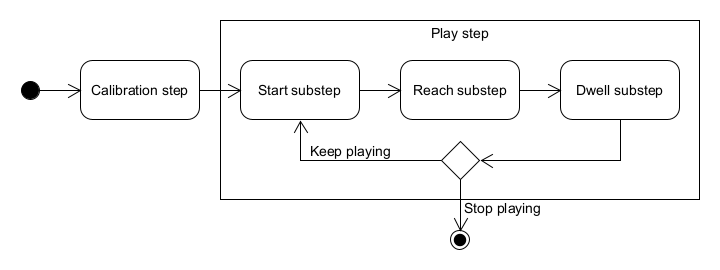

After a calibration step, which involves positioning the participant at an sufficient distance from the camera, virtual targets appear. The participant must then reach these targets with their hand (play step).

To be validated, a target must :

- Be reached before the end of the allowed time
- Using a maximum trunk compensation of 5°
- And dwell for 1 second to ensure a controlled movement

<table>
    <thead>
        <tr>
            <th width="300px">Step</th>
            <th width="500px">Illustration</th>
        </tr>
    </thead>
    <tbody>
        <tr>
            <td>
                Calibration step
            </td>
            <td>
                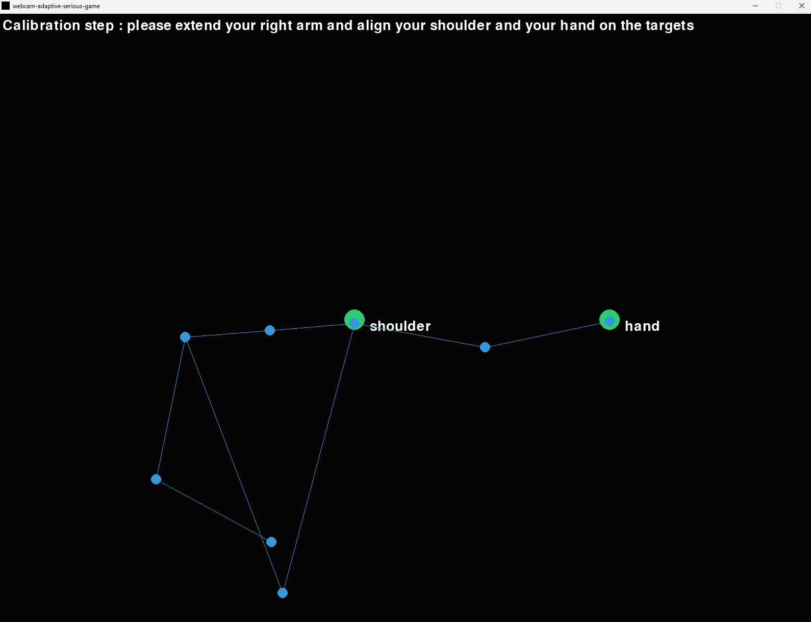
            </td>
        </tr>
        <tr>
            <td>
                Start substep (play step)
            </td>
            <td>
                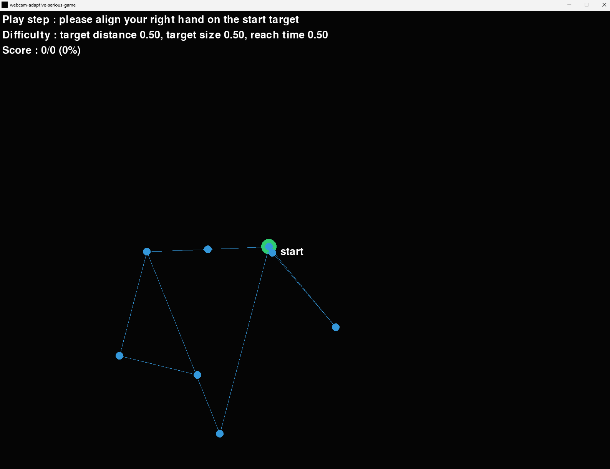
            </td>
        </tr>
        <tr>
            <td>
                Reach substep (play step)
            </td>
            <td>
                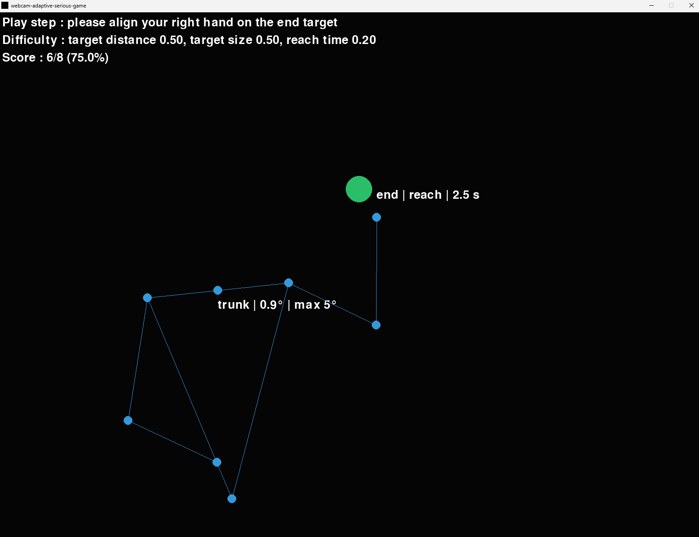
            </td>
        </tr>
            <tr>
            <td>
                Trunk compensation
            </td>
            <td>
                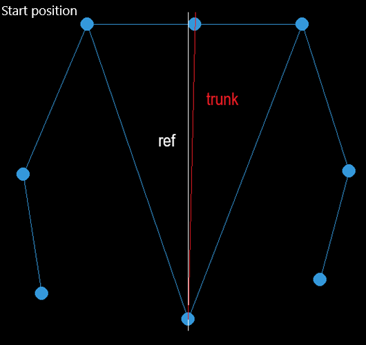
                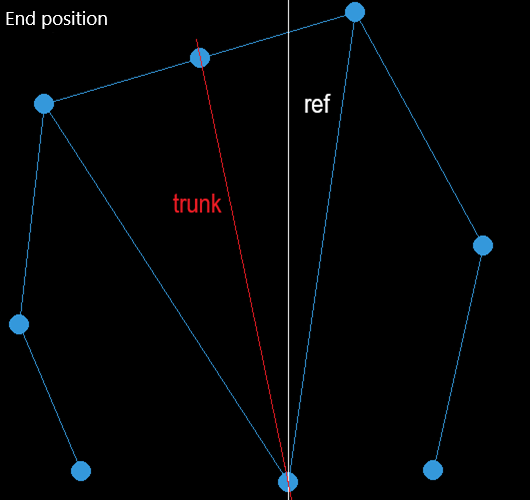
            </td>
        </tr>
    </tbody>
</table>

## DDA techniques

The goal of the DDA is to automatically adjust the difficulty so that the player maintains an average score of 75%. This keeps the player motivated (not too difficult) while encouraging progress (not too easy).

The difficulty has three dimensions (adjustable parameters) :

- The distance of the target
- The size of the target
- The allowed time to reach the target

This project contains three DDA :

- A random-based, which randomly selects the difficulty dimension to adjust (with a probability of 1/3)
- A rule-based, that uses game metrics to select the difficulty dimension to adjust, and does not use any kinematics
- A data-based, that uses kinematics and a Contextual Bandit model to select the difficulty dimension to adjust

<table>
    <thead>
        <tr>
            <th width="300px">DDA</th>
            <th width="500px">Illustration</th>
        </tr>
    </thead>
    <tbody>
        <tr>
            <td>
                Random-based DDA
            </td>
            <td>
                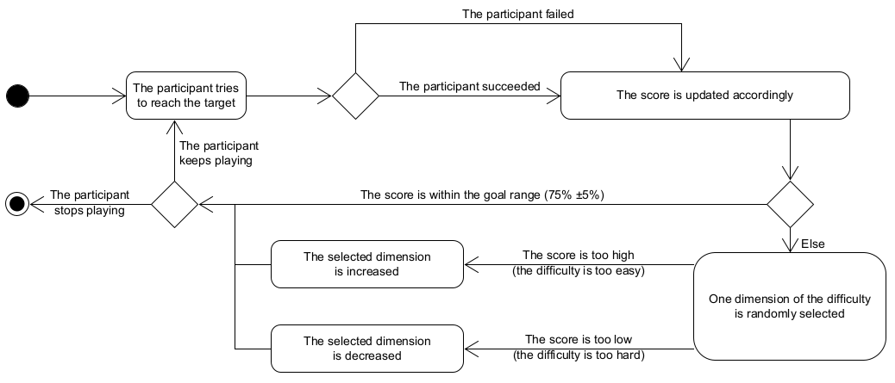
            </td>
        </tr>
        <tr>
            <td>
                Rule-based DDA
            </td>
            <td>
                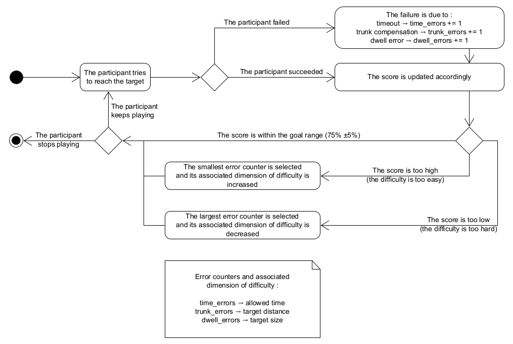
            </td>
        </tr>
        <tr>
            <td>
                Data-based DDA
            </td>
            <td>
                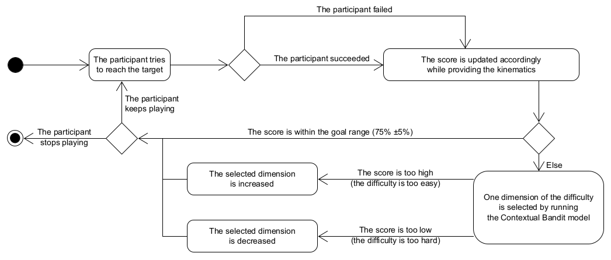
            </td>
        </tr>
    </tbody>
</table>

## Setup

The setup consists of :

- A 2D webcam (no depth sensor)
- MediaPipe as a tracking system
- CKATool for kinematics computation
- PyGame for game rendering
- MABWiser for the Contextual Bandit

Note : the CKATool version used is a [fork](https://github.com/comtedavid92/ckatool). This version has some changes, read its README for more information.

## Data flow

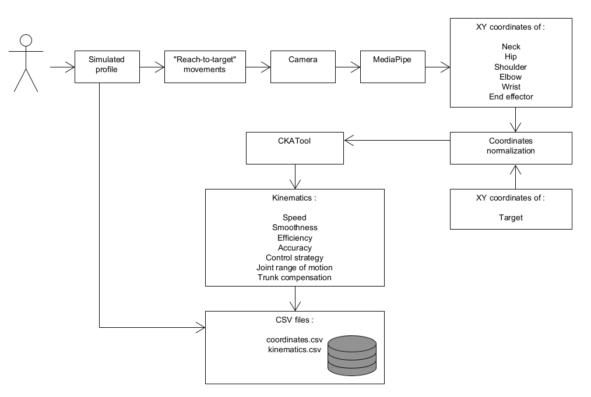

The movements of the participant are captured by the camera. MediaPipe then computes the body joint coordinates. After normalisation of the joint coordinates and the target coordinates, CKATool computes the kinematics. The coordinates and kinematics are saved to CSV files for further analysis.

## Implementation

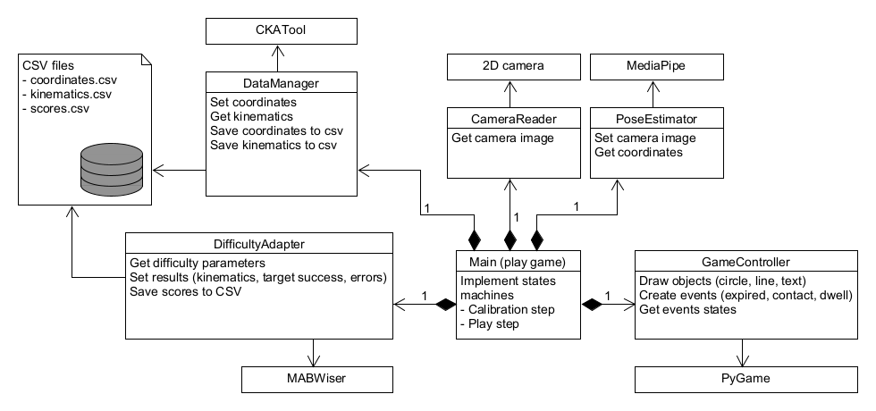

<table>
    <thead>
        <tr>
            <th>Block</th>
            <th>Function</th>
        </tr>
    </thead>
    <tbody>
        <tr>
            <td>
                Main (play game)
            </td>
            <td>
                Entry point of the game. It implements two state machines : the calibration step and the play step. It also contains all the main objects
            </td>
        </tr>
        <tr>
            <td>
                CameraReader
            </td>
            <td>
                Interface with the camera. This class is responsible for capturing images
            </td>
        </tr>
        <tr>
            <td>
                PoseEstimator
            </td>
            <td>
                Interface with MediaPipe. This class extracts body joint coordinates from the images provided by CameraReader
            </td>
        </tr>
        <tr>
            <td>
                DataManager
            </td>
            <td>
                Interface with CKATool. This class computes kinematics based on the coordinates provided by PoseEstimator
            </td>
        </tr>
        <tr>
            <td>
                GameController
            </td>
            <td>
                Interface with PyGame. This class renders the body joints and targets, and manages events (target expired, target reached, dwell completed)
            </td>
        </tr>
        <tr>
            <td>
                DifficultyAdapter
            </td>
            <td>
                This class implements the DDA and allows for getting new difficulty parameters. For the data-based DDA, it uses MABWiser
            </td>
        </tr>
    </tbody>
</table>

## Experiments

No impaired participants were recruited, only healthy participants were recruited.

These participants simulated three profiles while playing, from healthiest to most impaired :

- Profile 1 (healthy) : natural movements
- Profile 2 (moderate simulated impairment) : not natural, slow, jerky movements with pauses
- Profile 3 (severe simulated impairment) : not natural, slow, jerky movements with pauses and trunk compensation

The data collected from these experiments enabled :

- The validation of the setup (reach movements) : [cluster_analysis_reach](cluster_analysis_reach/)
- The validation of the setup (dwell movements) : [cluster_analysis_dwell](cluster_analysis_dwell/)
- The selection of a Contextual Bandit model : [replay_analysis](replay_analysis/)
- The training of Contextual Bandit models : [model_training](model_training/)
- The comparison of the DDA techniques : [dda_analysis](dda_analysis/)

## Usage

Install the requirements :

```bash
python -m pip install -r requirements.txt
```

For CKATool :

- Get the fork : [link](https://github.com/comtedavid92/ckatool)
- Install it by following : [link](https://github.com/comtedavid92/ckatool?tab=readme-ov-file#install-as-a-library)

Run the game :

```bash
python __play_game.py "<id>" "<trained_arm>" "<dda_type>" "<pretrained_model_path>"
```

Parameters :

- id : experiment ID
- trained_arm : "left" or "right"
- dda_type : "random", "rule" or "data"
- pretrained_model_path : "none" or path to a pretrained model (required for the data-based DDA)

Example :

```bash
python __play_game.py "foobar" "right" "random" "none"
python __play_game.py "foobar" "right" "rule" "none"
python __play_game.py "foobar" "right" "data" "model_training/2026-03-29-18-15-41/LinGreedy (epsilon = 0.2).pkl"
```

## Disclaimer

All data in this repository are mine, and therefore do not raise any personal data protection issues.