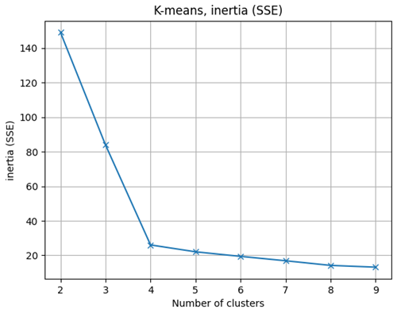
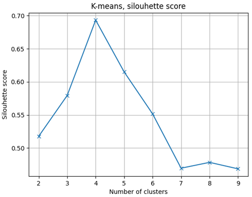

# Cluster Analysis

This analysis aimed to validate the setup based on a 2D webcam, MediaPipe and the kinematics from CKATool.

Since the 2D camera does not have a depth sensor, the Z coordinates have all been set to zero.

The CKATool version used is a fork : https://github.com/comtedavid92/ckatool. This version has some changes, please read its README for more information.

## Experiment

The use case is : post-stroke upper-limb rehabilitation.

For this experiment, four simulated profiles were attempted :

- Profile 1 (healthy) : natural movements
- Profile 2 (mild simulated impairment) : natural but slow movements
- Profile 3 (moderate simulated impairment) : not natural, slow, jerky movements with pauses
- Profile 4 (severe simulated impairment): not natural, slow, jerky movements with pauses and trunk compensation

For each profile, 15 "reach-to-target" movements were done.

The camera was placed at a fixed distance for all attempted profiles. In addition, the coordinates were normalised by shoulder width to reduce errors related to the camera distance.

Expected results :

- The elbow method will indicate 4 clusters
- The silhouette score will indicate 4 clusters
- With 4 clusters, the adjusted rand index will be high

Together, these results would confirm that the setup is relevant for a simple "reach-to-target" serious game.

## Results

### Excel analysis

An initial analysis was performed using Excel where each kinematic was plotted against the attempted profiles. After the Excel analysis, these kinematics were selected because they showed a good ability to distinguish the attempted profiles :
- wrist_number_of_velocity_peaks
- wrist_mean_velocity
- wrist_sparc
- wrist_jerk
- trunk_rom
- hand_path_ratio

Other kinematics also showed good ability to distinguish, but did not provide much additional information. Other features were not sufficiently discriminative and were excluded.

### Cluster analysis

The elbow method indicated 4 clusters :



The silhouette score indicated also 4 clusters :



With 4 clusters, the adjusted rand index indicated a result of 1.0.

## Reproduce the experiment

### Movements record

To record movements, run :

```bash
python ../__recorder.py
```

### Cluster analysis

Concatenate the kinematics into a single file :

1. Get the kinematics in the experiments folder
2. Concatenate the kinematics into a single CSV
3. For each row, set the attempted profile

To run the analysis, run :

```bash
python analysis.py
```

## Disclaimer

I am the only participant, the data in the experiments folder is mine.

No data from other participants were collected, and so no personal data protection issues are involved.