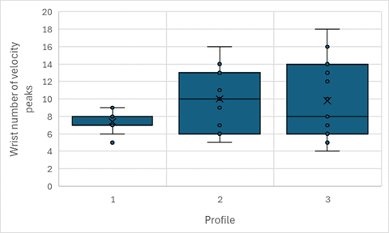
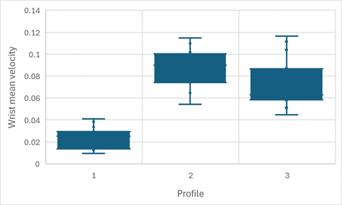
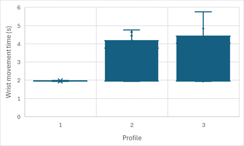
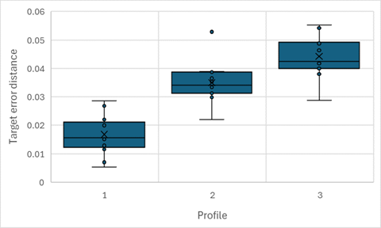
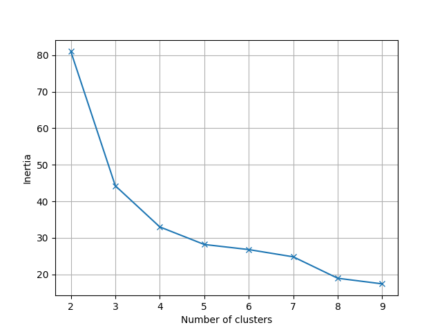
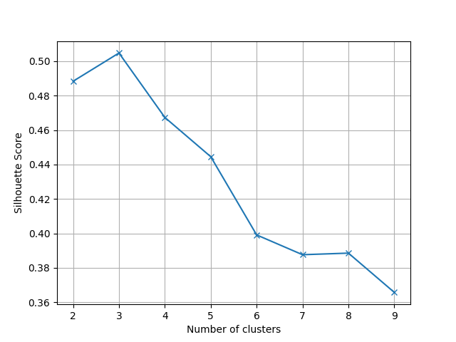
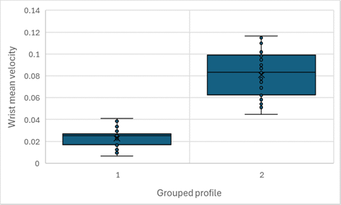
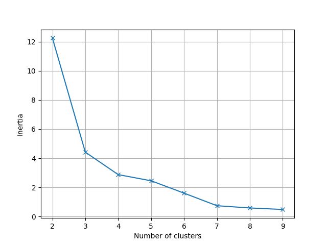
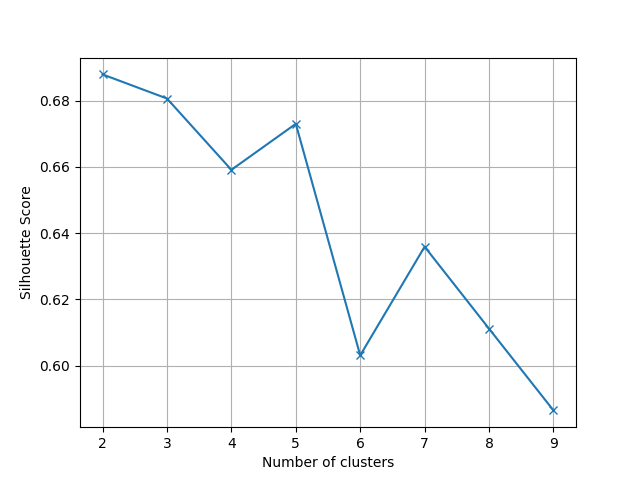

# Cluster analysis (dwell)

Please read first the [cluster analysis](../cluster_analysis_reach/) of the "reach-to-target" movements, as it gives the context and additional information. For this analysis, the goals were similar, but it was done for the classification of "target-stabilization" tasks. In these tasks, the goal is to keep the hand inside the target for an amount of time. If the hand leaves the target, the timer is reset.

## Results

### Excel analysis

After the Excel analysis, these kinematics were selected :

<table>
<thead>
<tr>
    <th width="300px">Kinematic</th>
    <th width="400px">Plot</th>
</tr>
</thead>
<tbody>
<tr>
    <td>wrist_number_of_velocity_peaks</td>
    <td></td>
</tr>
<tr>
    <td>wrist_mean_velocity</td>
    <td></td>
</tr>
<tr>
    <td>wrist_movement_time</td>
    <td></td>
</tr>
<tr>
    <td>target_error_distance</td>
    <td></td>
</tr>
</tbody>
</table>

### Cluster analysis

<table>
<tr>
    <th width="300px">Metric</th>
    <th width="400px">Result</th>
</tr>
<tr>
    <td>Inertia (elbow method)</td>
    <td></td>
</tr>
<tr>
    <td>Silhouette score</td>
    <td></td>
</tr>
<tr>
    <td>Adjusted rand index (k=2)</td>
    <td>0.15</td>
</tr>
<tr>
    <td>Adjusted rand index (k=4)</td>
    <td>0.38</td>
</tr>
</table>

### Excel analysis (grouped)

As the results were not conclusive, profiles 1 and 2 were grouped together, and the same was done for profiles 3 and 4. After the Excel analysis, this kinematic was selected :

<table>
<thead>
<tr>
    <th width="300px">Kinematic</th>
    <th width="400px">Plot</th>
</tr>
</thead>
<tbody>
<tr>
    <td>wrist_mean_velocity</td>
    <td></td>
</tr>
</tbody>
</table>

### Cluster analysis (grouped)

<table>
<tr>
    <th width="300px">Metric</th>
    <th width="400px">Result</th>
</tr>
<tr>
    <td>Inertia (elbow method)</td>
    <td></td>
</tr>
<tr>
    <td>Silhouette score</td>
    <td></td>
</tr>
<tr>
    <td>Adjusted rand index (k=2)</td>
    <td>0.87</td>
</tr>
<tr>
    <td>Adjusted rand index (k=4)</td>
    <td>0.66</td>
</tr>
</table>

## Reproduce the experiment

### Tasks record

To record tasks, run :

```bash
python ../__record_dwell.py
```

### Cluster analysis

Concatenate the kinematics into a single file :

1. Get the kinematics in the experiments folder
2. Concatenate the kinematics into a single CSV
3. For each row, set the attempted profile

To run the analysis, run :

```bash
python cluster_analysis.py
```

## Disclaimer

I am the only participant, the data in the experiments folder is mine. No data from other participants were collected, and so no personal data protection issues are involved.