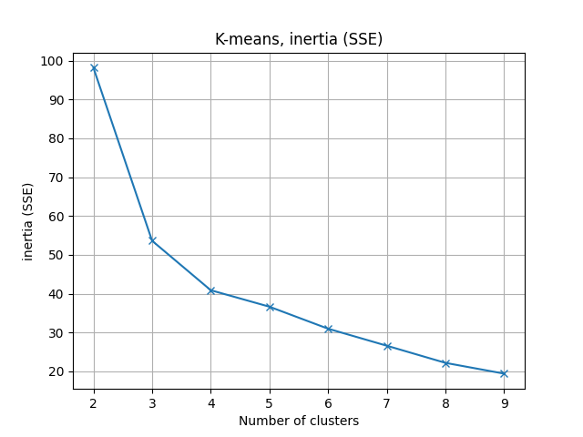
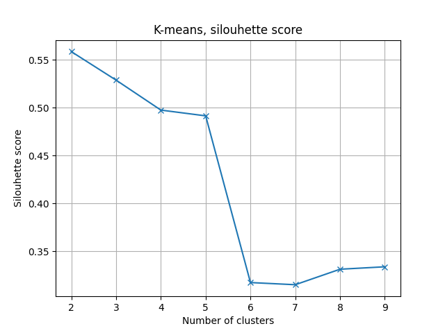
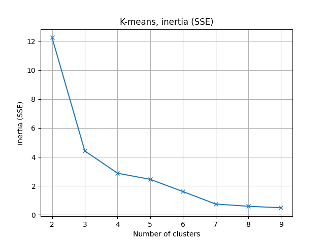
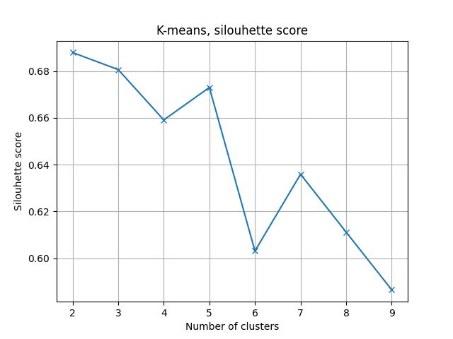

# Cluster analysis (dwell)

This is an analysis similar the [reach](../cluster_analysis_reach/) one. Please read first the reach analysis. Here, the goal is not to reach a target, but to keep the hand above a target (dwell).

## Results

### Excel analysis

After the Excel analysis, these kinematics were selected :

- wrist_number_of_velocity_peaks
- wrist_mean_velocity
- wrist_movement_time
- target_error_distance

### Cluster analysis

- The elbow method indicated 4 clusters :



- The silhouette score indicated 2 clusters :



- With 2 clusters, the adjusted rand index indicated a result of 0.14

- With 4 clusters, the adjusted rand index indicated a result of 0.38

### Excel analysis (grouped)

As the results were not conclusive, profiles 1 and 2 were grouped together, and the same was done for profiles 3 and 4. After the Excel analysis, these kinematics were selected :

- wrist_mean_velocity

### Cluster analysis (grouped)

- The elbow method indicated 4 clusters :



- The silhouette score indicated 2 clusters :



- With 2 clusters, the adjusted rand index indicated a result of 0.87

- With 4 clusters, the adjusted rand index indicated a result of 0.66

## Reproduce the experiment

### Hold record

To record a hold, run :

```bash
python ../__record_dwell.py
```

### Cluster analysis

Concatenate the kinematics into a single file :

1. Get the kinematics in the experiments folder
2. Concatenate the kinematics into a single CSV
3. For each row, set the attempted profile

To run the analysis, run :

```bash
python cluster_analysis.py
```

## Disclaimer

I am the only participant, the data in the experiments folder is mine. No data from other participants were collected, and so no personal data protection issues are involved.