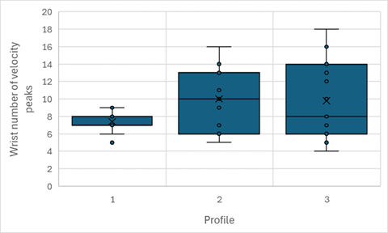
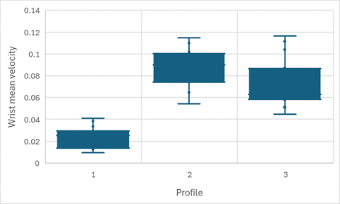
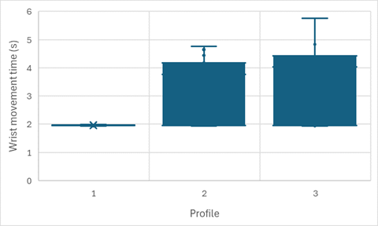
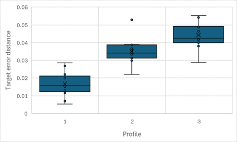
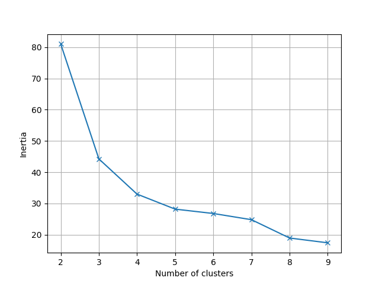
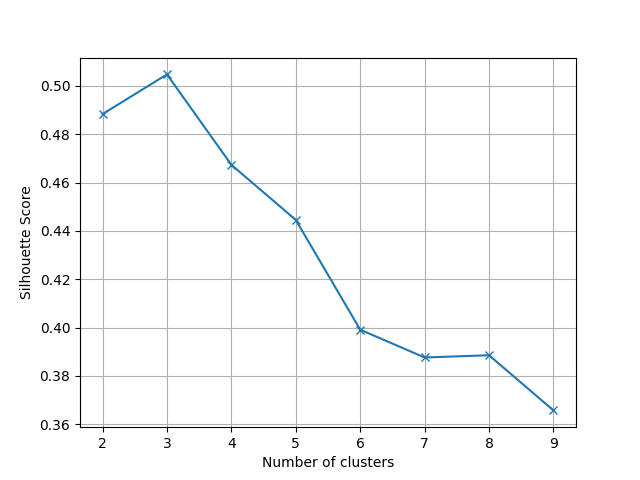
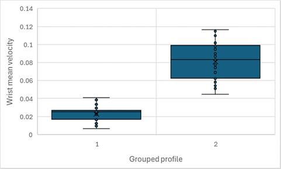
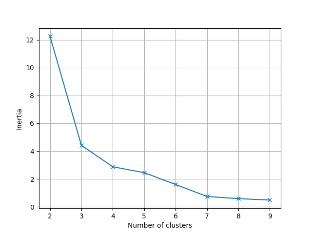
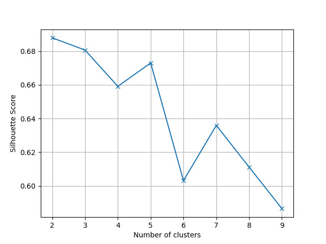

# Cluster analysis (dwell)

This analysis aimed to :

- Identify the kinematics to use in the game (dwell step)

## Experiment

For each profile, 15 "target-stabilization" movements were done, where the goal was to dwell on a target for 2 seconds.

For each movement, kinematics were computed and used for the analysis.

## Results

An initial analysis was performed where each kinematic was plotted against the simulated profiles. These kinematics were kept because they showed a good ability to distinguish the attempted profiles :

<table>
    <thead>
        <tr>
            <th width="300px">Kinematic</th>
            <th width="500px">Plot</th>
        </tr>
    </thead>
    <tbody>
        <tr>
            <td>Wrist number of velocity peaks</td>
            <td></td>
        </tr>
        <tr>
            <td>Wrist mean velocity</td>
            <td></td>
        </tr>
        <tr>
            <td>Wrist movement time</td>
            <td></td>
        </tr>
        <tr>
            <td>Target error distance</td>
            <td></td>
        </tr>
    </tbody>
</table>

Using these kinematics, a cluster analysis was performed and gave the following results :

<table>
<tr>
    <th width="300px">Metric</th>
    <th width="500px">Plot</th>
</tr>
<tr>
    <td>Inertia</td>
    <td></td>
</tr>
<tr>
    <td>Silhouette Score</td>
    <td></td>
</tr>
<tr>
    <td>ARI (k=3)</td>
    <td>0.48</td>
</tr>
</table>

As the results were not conclusive, 15 additional "target-stabilization" movements were performed for profile 1 to balance the data, and profiles 2 and 3 were grouped together. After plotting the kinematics again against the simulated profiles, this kinematic was kept :

<table>
<thead>
<tr>
    <th width="300px">Kinematic</th>
    <th width="500px">Plot</th>
</tr>
</thead>
<tbody>
<tr>
    <td>Wrist mean velocity</td>
    <td></td>
</tr>
</tbody>
</table>

Using this kinematic, another cluster analysis was performed and gave the following results :

<table>
<tr>
    <th width="300px">Metric</th>
    <th width="500px">Plot</th>
</tr>
<tr>
    <td>Inertia</td>
    <td></td>
</tr>
<tr>
    <td>Silhouette Score</td>
    <td></td>
</tr>
<tr>
    <td>ARI (k=2)</td>
    <td>0.87</td>
</tr>
</table>

## Conclusion

The initial analysis showed that the movements did not naturally separate into three distinct clusters (each profile).

In addition, the ARI for the initial analysis was low. Therefore, the profiles were grouped to attempt a healthy vs impaired classification.

The results of this second analysis were more conclusive, suggesting that this kinematic is relevant and that a DDA can learn from it to distinguish between healthy and impaired profiles :

- Wrist mean velocity

This kinematic was therefore selected for the game (dwell step).