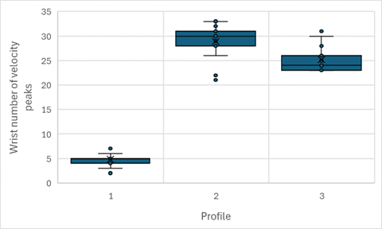
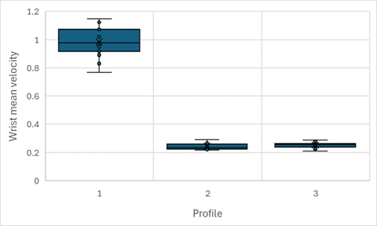
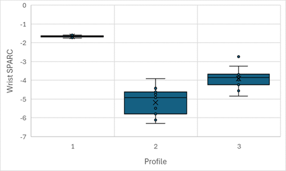
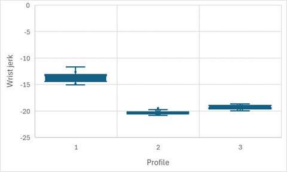
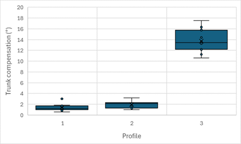
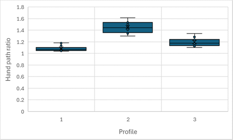
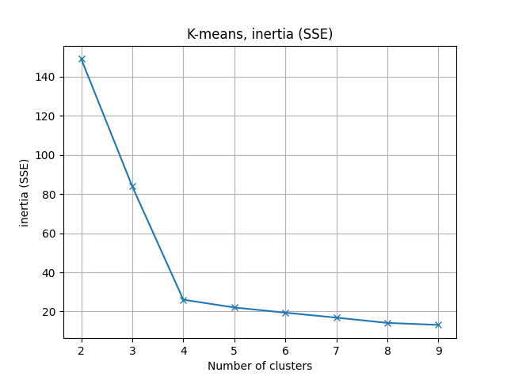
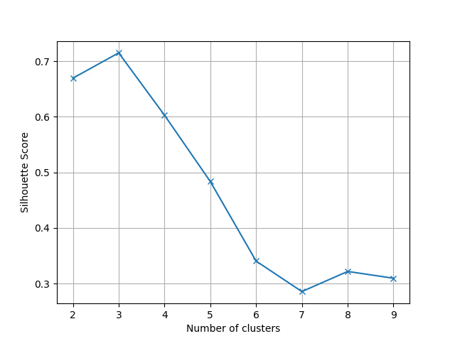

# Cluster analysis (reach)

This analysis aimed to validate the setup based on a 2D webcam, MediaPipe and the kinematics from CKATool. It also aimed to identify the right kinematics for classifying movements.

Notes :

- The CKATool version used is a fork : https://github.com/comtedavid92/ckatool. This version has some changes, please read its README for more information
- Since the 2D camera does not have a depth sensor, the Z coordinates have all been set to zero

## Experiment

The use case is : post-stroke upper-limb rehabilitation.

For this experiment, 4 simulated profiles were attempted :

- Profile 1 (healthy) : natural movements
- Profile 2 (mild simulated impairment) : natural but slow movements
- Profile 3 (moderate simulated impairment) : not natural, slow, jerky movements with pauses
- Profile 4 (severe simulated impairment): not natural, slow, jerky movements with pauses and trunk compensation

For each profile, 15 "reach-to-target" movements were done.

The camera was placed at a fixed distance for all attempted profiles. In addition, the coordinates were normalised by shoulder width to reduce errors related to the camera distance.

Data flow :


Expected results : the movements will naturally separate into 4 distinct clusters (from healthy to severe simulated impairment profiles). This would indicate that the setup is relevant for a simple "reach-to-target" serious game and that a data-based dynamic difficulty adjustment technique can learn from the kinematics.

## Results

### Excel analysis

An initial analysis was performed using Excel where each kinematic was plotted against the attempted profiles. After the Excel analysis, these kinematics were selected because they showed a good ability to distinguish the attempted profiles :

<table>
<thead>
<tr>
    <th width="300px">Kinematic</th>
    <th width="400px">Plot</th>
</tr>
</thead>
<tbody>
<tr>
    <td>wrist_number_of_velocity_peaks</td>
    <td></td>
</tr>
<tr>
    <td>wrist_mean_velocity</td>
    <td></td>
</tr>
<tr>
    <td>wrist_sparc</td>
    <td></td>
</tr>
<tr>
    <td>wrist_jerk</td>
    <td></td>
</tr>
<tr>
    <td>trunk_rom</td>
    <td></td>
</tr>
<tr>
    <td>hand_path_ratio</td>
    <td></td>
</tr>
</tbody>
</table>

### Cluster analysis

The cluster analysis showed that the movements naturally separate into 4 clusters :

<table>
<tr>
    <th width="300px">Metric</th>
    <th width="400px">Result</th>
</tr>
<tr>
    <td>Inertia (elbow method)</td>
    <td></td>
</tr>
<tr>
    <td>Silhouette score</td>
    <td></td>
</tr>
<tr>
    <td>Adjusted rand index</td>
    <td>1.0</td>
</tr>
</table>

## Reproduce the experiment

### Movements record

To record movements, run :

```bash
python ../__record_reach.py
```

### Cluster analysis

Concatenate the kinematics into a single file :

1. Get the kinematics in the experiments folder
2. Concatenate the kinematics into a single CSV
3. For each row, set the attempted profile

To run the analysis, run :

```bash
python cluster_analysis.py
```

## Disclaimer

I am the only participant, the data in the experiments folder is mine. No data from other participants were collected, and so no personal data protection issues are involved.