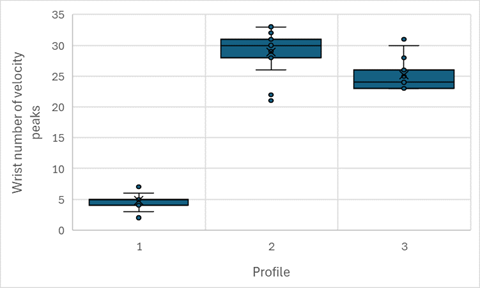
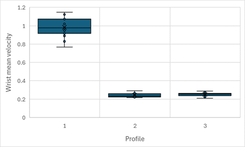
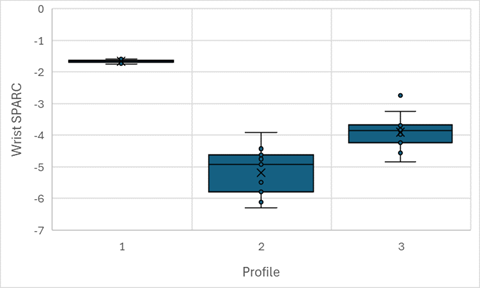
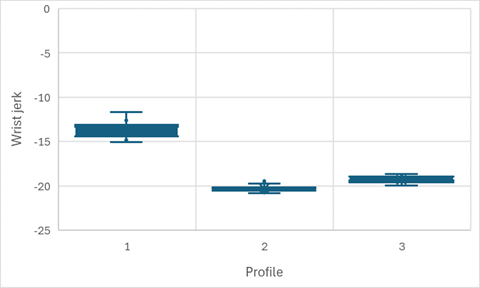
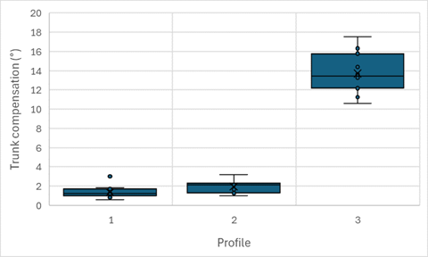
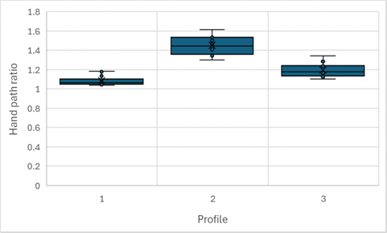
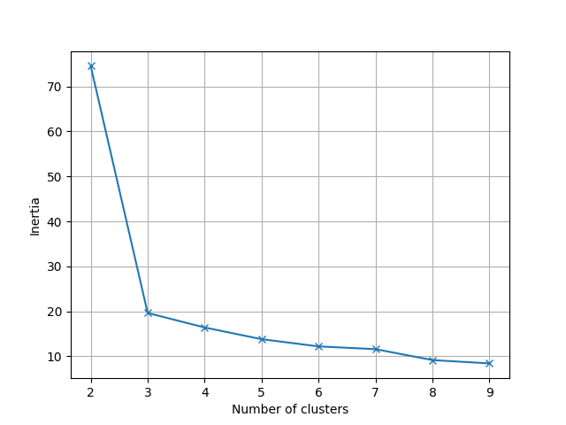
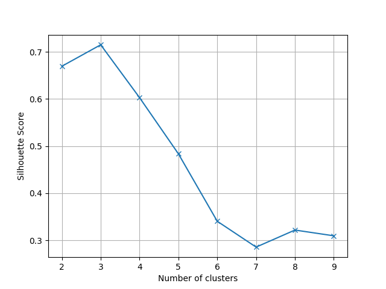

# Cluster analysis (reach)

This analysis aimed to :

- Validate the setup
- Identify the kinematics to use in the game (reach step)

## Experiment

For each profile, 15 "reach-to-target" movements were done, where the goal was to reach an end target from a start target.

For each movement, kinematics were computed and used for the analysis.

## Results

An initial analysis was performed where each kinematic was plotted against the simulated profiles. These kinematics were kept because they showed a good ability to distinguish the attempted profiles :

<table>
    <thead>
        <tr>
            <th width="300px">Kinematic</th>
            <th width="500px">Plot</th>
        </tr>
    </thead>
    <tbody>
        <tr>
            <td>Wrist number of velocity peaks</td>
            <td></td>
        </tr>
        <tr>
            <td>Wrist mean velocity</td>
            <td></td>
        </tr>
        <tr>
            <td>Wrist SPARC</td>
            <td></td>
        </tr>
        <tr>
            <td>Wrist jerk</td>
            <td></td>
        </tr>
        <tr>
            <td>Trunk ROM</td>
            <td></td>
        </tr>
        <tr>
            <td>Hand path ratio</td>
            <td></td>
        </tr>
    </tbody>
</table>

Using these kinematics, a cluster analysis was performed and gave the following results :

<table>
<tr>
    <th width="300px">Metric</th>
    <th width="500px">Plot</th>
</tr>
<tr>
    <td>Inertia</td>
    <td></td>
</tr>
<tr>
    <td>Silhouette Score</td>
    <td></td>
</tr>
<tr>
    <td>ARI</td>
    <td>1.0</td>
</tr>
</table>

## Conclusion

The experiment showed that the movements naturally separated into three distinct clusters (each profile), suggesting that the setup is relevant and that a DDA can learn from the kinematics.

The experiment also allowed the selection of the following kinematics for the game (reach step) :

- Wrist number of velocity peaks
- Wrist mean velocity
- Wrist SPARC
- Wrist jerk
- Trunk ROM
- Hand path ratio