# DDA analysis

This analysis aimed to :

- Compare empirically the rule-based DDA and the data-based DDA
- Determine if the data-based DDA adds value

## Experiment

A total of 12 participants were recruited to play the game. Most participants performed around 100 targets per profile.

The first participants played with the rule-based DDA :

| Participant | Profile 1 | Profile 2 | Profile 3 |
|-------------|-----------|-----------|-----------|
| 0001        | 0x        | 1x        | 0x        |
| 0002        | 0x        | 0x        | 1x        |
| 0011        | 1x        | 1x        | 1x        |
| 0013        | 1x        | 1x        | 1x        |
| 0014        | 1x        | 1x        | 0x        |
| 0015        | 1x        | 1x        | 1x        |
| 0016        | 1x        | 0x        | 1x        |
| 0017        | 1x        | 1x        | 1x        |

The second participants played with the data-based DDA :

| Participant | Profile 1 | Profile 2 | Profile 3 |
|-------------|-----------|-----------|-----------|
| 0001        | 1x        | 1x        | 1x        |
| 0002        | 1x        | 1x        | 1x        |
| 0007        | 1x        | 1x        | 1x        |
| 0008        | 1x        | 1x        | 1x        |
| 0009        | 1x        | 1x        | 1x        |
| 0010        | 1x        | 1x        | 1x        |

This is around 600 targets per profile and per DDA, for a total of 3600 targets.

## Convergence speed

This analysis consisted of comparing the DDA on convergence, as well as on the speed of convergence, which indicates after how many targets, the participants reach the goal score of 75% ± 5%.

## Results (convergence speed)

<table>
    <thead>
        <tr>
            <th width="300px">Metric</th>
            <th width="500px">Plot</th>
        </tr>
    </thead>
    <tbody>
        <tr>
            <td>
                Mean window score, profile 1
            </td>
            <td>
                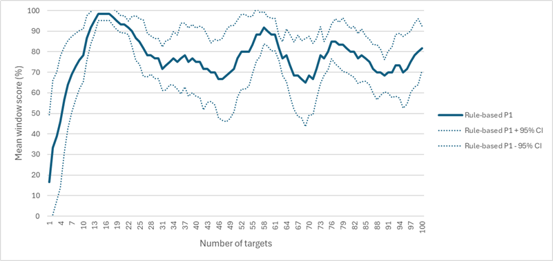
                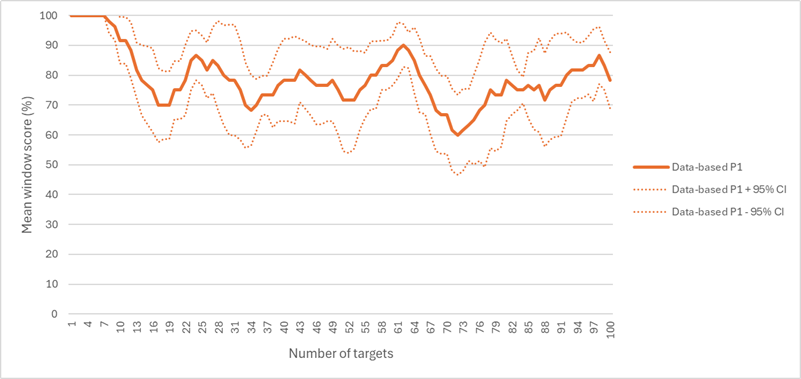
            </td>
        </tr>
        <tr>
            <td>
                Mean window score, profile 2
            </td>
            <td>
                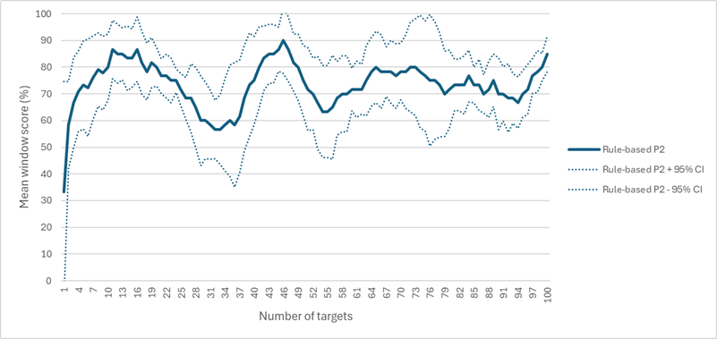
                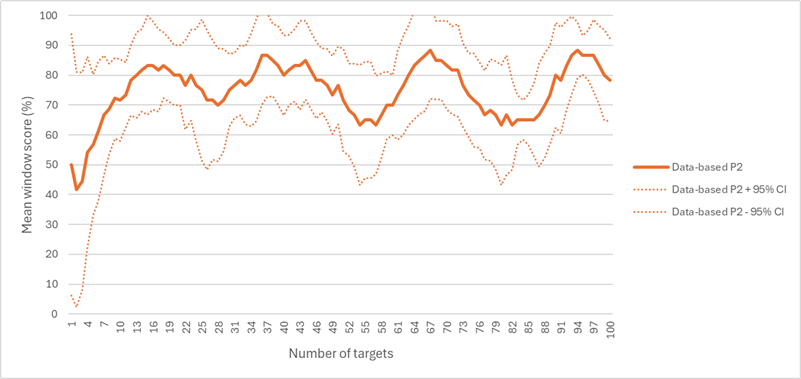
            </td>
        </tr>
        <tr>
            <td>
                Mean window score, profile 3
            </td>
            <td>
                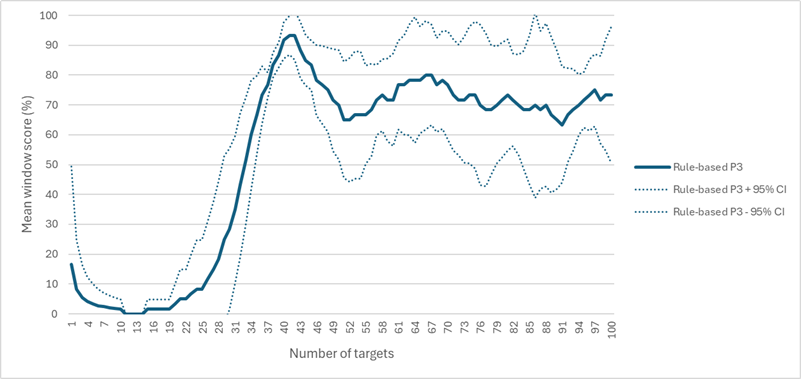
                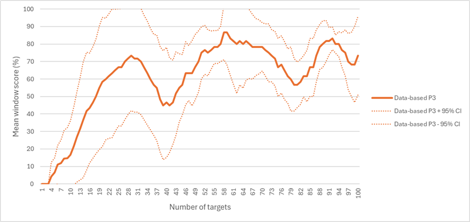
            </td>
        </tr>
    </tbody>
</table>

Both DDA successfully converged toward the goal score and showed oscillations after convergence. The confidence intervals appeared comparable across DDA for each profile.

<table>
    <thead>
        <tr>
            <th width="300px">Metric</th>
            <th width="500px">Plot</th>
        </tr>
    </thead>
    <tbody>
        <tr>
            <td>
                Number of targets to convergence
            </td>
            <td>
                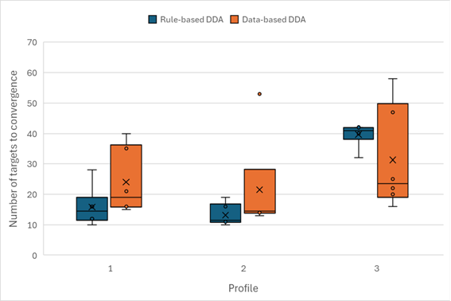
            </td>
        </tr>
        <tr>
            <td>
                Percentage of experiments that converged, profile 1
            </td>
            <td>
                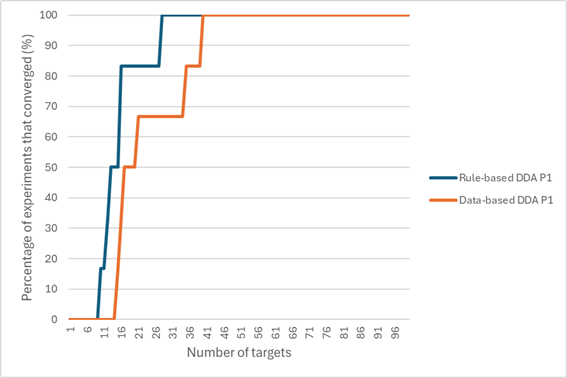
            </td>
        </tr>
        <tr>
            <td>
                Percentage of experiments that converged, profile 2
            </td>
            <td>
                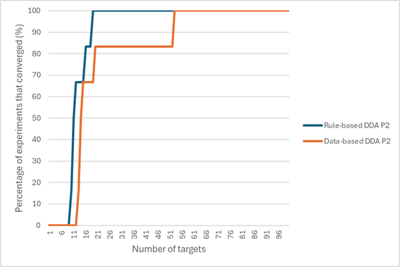
            </td>
        </tr>
        <tr>
            <td>
                Percentage of experiments that converged, profile 3
            </td>
            <td>
                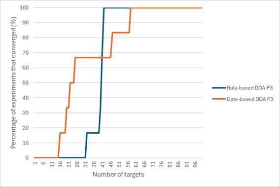
            </td>
        </tr>
    </tbody>
</table>

The rule-based DDA converged faster for profiles 1 and 2, requiring fewer targets with lower variability.  

For profile 3, the data-based DDA converged faster in some cases, but showed higher variability. However, 100% convergence is reached earlier with the rule-based DDA.

## Stability after convergence

This analysis compared how well each DDA maintains the goal score after convergence.

## Results (stability after convergence)

<table>
    <thead>
        <tr>
            <th width="300px">Metric</th>
            <th width="500px">Plot</th>
        </tr>
    </thead>
    <tbody>
        <tr>
            <td>
                Mean window score after convergence
            </td>
            <td>
                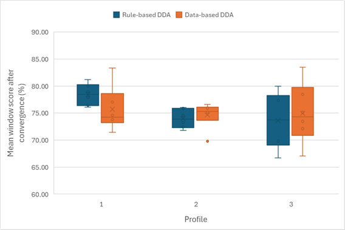
            </td>
        </tr>
        <tr>
            <td>
                Mean distance from the goal score range after convergence
            </td>
            <td>
                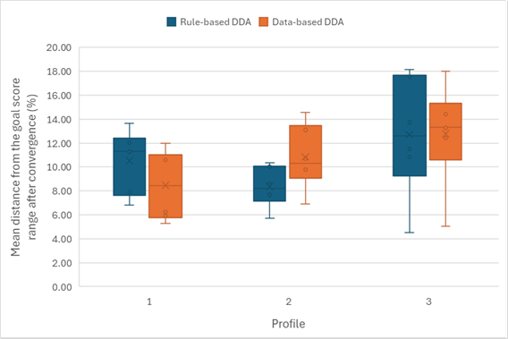
            </td>
        </tr>
        <tr>
            <td>
                Percentage of targets within the goal score range after convergence
            </td>
            <td>
                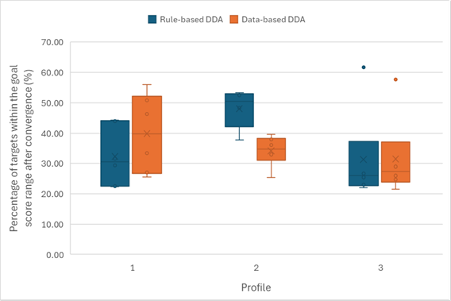
            </td>
        </tr>
    </tbody>
</table>

After convergence, both DDA maintained scores close to the goal range. Most values fell within the goal score range, and variability is overall comparable, but with differences depending on the profile.

For profile 1, the data-based DDA showed slightly better distance to the target. For profile 2, the rule-based DDA performed better with lower variability. For profile 3, both DDA showed comparable median values, although the rule-based DDA has higher variability.

The data-based DDA achieved a higher percentage of targets within the goal range for profile 1, while the rule-based DDA performed better for profile 2. For profile 3, both DDA showed similar results.

## DDA reward

This analysis compared the DDA based on the reward obtained. The reward measures how much the score moves closer to the goal score after each target, when a difficulty parameter is adjusted.

## Results (DDA reward)

<table>
    <thead>
        <tr>
            <th width="300px">Metric</th>
            <th width="500px">Plot</th>
        </tr>
    </thead>
    <tbody>
        <tr>
            <td>
                Mean reward
            </td>
            <td>
                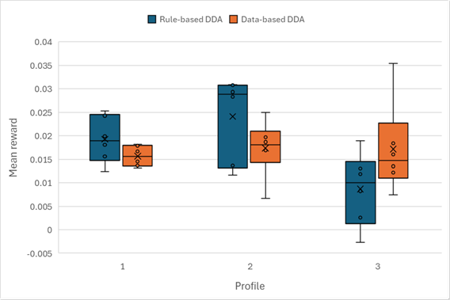
            </td>
        </tr>
    </tbody>
</table>

The rule-based DDA showed higher rewards for profiles 1 and 2, but with higher variability. For profile 3, the data-based DDA achieved higher rewards with lower variability.

## Final difficulty

This analysis compared the three difficulty dimensions based on their average values over the last 20 targets. A Spearman correlation was computed between the final difficulty parameters and the simulated profiles.

## Results (final difficulty)

<table>
    <thead>
        <tr>
            <th width="300px">Metric</th>
            <th width="500px">Plot</th>
        </tr>
    </thead>
    <tbody>
        <tr>
            <td>
                Target distance
            </td>
            <td>
                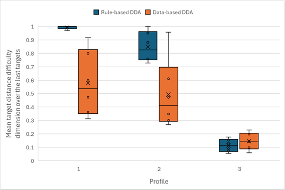
            </td>
        </tr>
        <tr>
            <td>
                Target size
            </td>
            <td>
                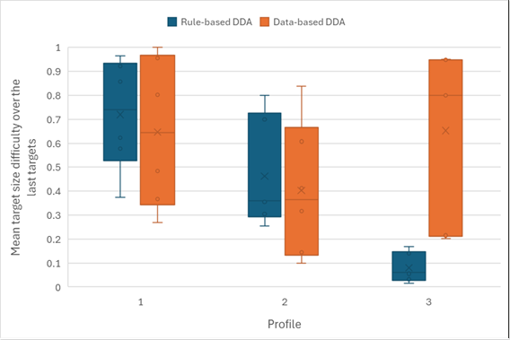
            </td>
        </tr>
        <tr>
            <td>
                Allowed time
            </td>
            <td>
                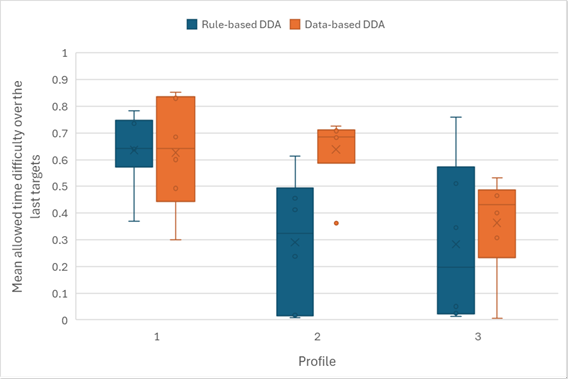
            </td>
        </tr>
    </tbody>
</table>

The rule-based DDA tended to push the target distance difficulty to its maximum for profiles 1 and 2, and to its minimum for profile 3. This is not the case for the data-based DDA, which varied this parameter over a wider range for profiles 1 and 2. For profile 3, both DDA showed similar behavior for this parameter.

For target size, the results were similar between both DDA for profiles 1 and 2. However, for profile 3, the rule-based DDA tended to push the parameter to its minimum difficulty, while the data-based DDA did not show a clear strategy, with more variable values.

Regarding the allowed time, the medians were comparable for profile 1, although the data-based DDA showed higher variability. For profile 2, the rule-based DDA appeared to have a less defined strategy, with more variable values compared to the data-based DDA. The same behaviour was observed for profile 3.

Spearman correlation, rule-based DDA :

| Difficulty dimension                                  | Correlation |
|-------------------------------------------------------|-------------|
| Mean target distance difficulty over the last targets | -0.90       |
| Mean target size difficulty over the last targets     | -0.87       |
| Mean allowed time difficulty over the last targets    | -0.50       |

Spearman correlation, data-based DDA :

| Difficulty dimension                                  | Correlation |
|-------------------------------------------------------|-------------|
| Mean target distance difficulty over the last targets | -0.77       |
| Mean target size difficulty over the last targets     | -0.10       |
| Mean allowed time difficulty over the last targets    | -0.49       |

The rule-based DDA showed strong correlations with the simulated profiles, especially for target distance and size. The data-based DDA showed weaker correlations, particularly for target size.

## Conclusion

Both DDA were able to converge the score toward the target.

However, the rule-based DDA appeared to converge faster on average than the data-based DDA. In terms of stability after convergence, both DDA showed comparable results, with no clear winner depending on the profile.

Regarding the reward, the rule-based DDA performed better on average, except for profile 3 where the data-based DDA achieved better results.

For the final difficulty, the rule-based DDA showed stronger correlations with the simulated profiles across all three dimensions.

Overall, although the data-based DDA performed better on some aspects, the rule-based DDA appeared more consistent and convincing on average. In addition, the rule-based DDA is simpler to implement. Therefore, the data-based DDA adds limited value compared to the rule-based DDA.