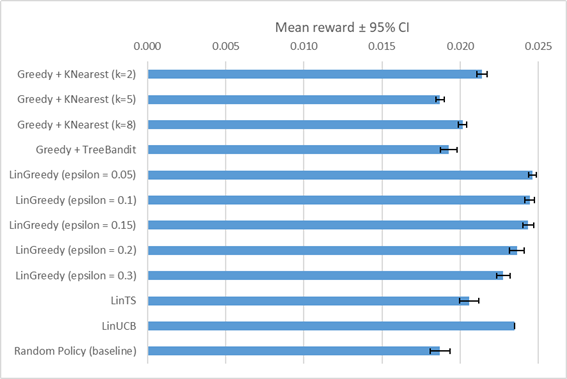
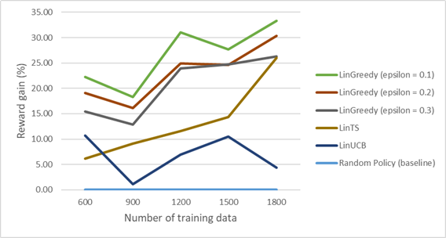
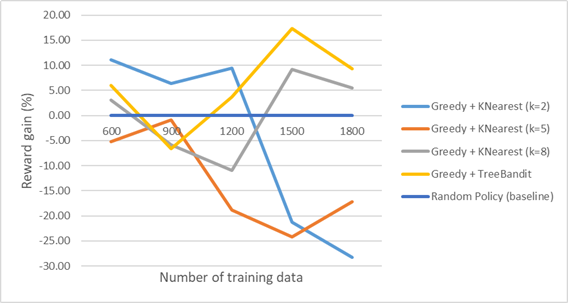

# Replay analysis

This analysis aimed to :

- Select a Contextual Bandit model for the data-based DDA

## Experiment

A total of 6 participants were recruited to play the game. Each participant performed around 100 targets per profile, except participants 0001 and 0002, who each performed the profiles two times :

| Participant | Profile 1 | Profile 2 | Profile 3 |
|-------------|-----------|-----------|-----------|
| 0001        | 2x        | 2x        | 2x        |
| 0002        | 2x        | 2x        | 2x        |
| 0003        | 1x        | 1x        | 1x        |
| 0004        | 1x        | 1x        | 1x        |
| 0005        | 1x        | 1x        | 1x        |
| 0006        | 1x        | 1x        | 1x        |

This is around 800 targets per profile, for a total of 2400 targets.

The game was played with the random-DDA, required by the replay method.

## Replay

A replay method was used to compare some Contextual Bandit models. The comparison was based on their average reward (how much the score moves closer to 75% after each target).

Linear models :

- LinGreedy (epsilon = 0.05)
- LinGreedy (epsilon = 0.1)
- LinGreedy (epsilon = 0.15)
- LinGreedy (epsilon = 0.2)
- LinGreedy (epsilon = 0.3)
- LinTS
- LinUCB

Nonlinear models :

- Greedy + KNearest (k=2)
- Greedy + KNearest (k=5)
- Greedy + KNearest (k=8)
- Greedy + TreeBandit

These models were compared against a baseline :

- Random Policy (baseline)

Around 1200 training data were used :

| Participant | Profile 1 | Profile 2 | Profile 3 |
|-------------|-----------|-----------|-----------|
| 0001        | 1x        | 1x        | 1x        |
| 0002        | 1x        | 1x        | 1x        |
| 0003        | 1x        | 1x        | 1x        |
| 0004        | 1x        | 1x        | 1x        | 

And around 1200 test data were also used :

| Participant | Profile 1 | Profile 2 | Profile 3 |
|-------------|-----------|-----------|-----------|
| 0001        | 1x        | 1x        | 1x        |
| 0002        | 1x        | 1x        | 1x        |
| 0005        | 1x        | 1x        | 1x        |
| 0006        | 1x        | 1x        | 1x        |

A total of 100 runs were performed to generate the results.

## Results (replay)

| Model                         | Mean    | Stdev   | 95% CI  |
|-------------------------------|---------|---------|---------|
| Greedy + KNearest (k=2)       | 0.02141 | 0.00164 | 0.00032 |
| Greedy + KNearest (k=5)       | 0.01871 | 0.00130 | 0.00025 |
| Greedy + KNearest (k=8)       | 0.02015 | 0.00144 | 0.00028 |
| Greedy + TreeBandit           | 0.01927 | 0.00274 | 0.00054 |
| LinGreedy (epsilon = 0.05)    | 0.02461 | 0.00128 | 0.00025 |
| LinGreedy (epsilon = 0.1)     | 0.02444 | 0.00149 | 0.00029 |
| LinGreedy (epsilon = 0.15)    | 0.02435 | 0.00182 | 0.00036 |
| LinGreedy (epsilon = 0.2)     | 0.02363 | 0.00234 | 0.00046 |
| LinGreedy (epsilon = 0.3)     | 0.02276 | 0.00224 | 0.00044 |
| LinTS                         | 0.02058 | 0.00314 | 0.00061 |
| LinUCB                        | 0.02348 | 0.00000 | 0.00000 |
| Random Policy (baseline)      | 0.01872 | 0.00323 | 0.00063 |

The standard deviation and 95% CI remain relatively small for all models, indicating stable rewards across runs.

Nonlinear models showed lower rewards than linear models, suggesting that a complex model is not necessary.

## Replay and learn

A replay and learn method was used to simulate what would happen in the game, where the DDA uses a pretrained model that learns online with each target.

So, models were pretrained on different subsets of the data and tested on the remaining data while learning online.

A total of 20 runs were performed for each subset to generate the results.

## Results (replay and learn)

<table>
    <thead>
        <tr>
            <th width="300px">Model</th>
            <th width="500px">Plot</th>
        </tr>
    </thead>
    <tbody>
        <tr>
            <td>
                Linear models
            </td>
            <td>
                
            </td>
        </tr>
        <tr>
            <td>
                Nonlinear models
            </td>
            <td>
                
            </td>
        </tr>
    </tbody>
</table>

LinGreedy models showed the largest gains, with gain improvements that tend to increase as the amount of training data increases.

## Conclusion

This experiment allowed the selection of the Contextual Bandit model : LinGreedy.

Even if epsilon = 0.2 showed slightly lower gains compared to epsilon = 0.1, it was chosen as the model for the data-based DDA to ensure a higher level of exploration during experiments with participants.